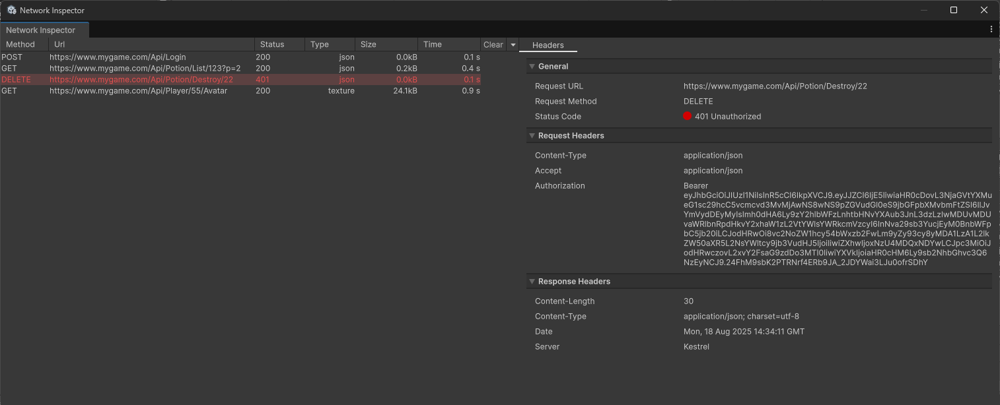

# UnityFetch

A wrapper for Unity's UnityWebRequest HTTP client, with the goal to make HTTP requests as developer-friendly as possible.


## Features

- Simple HTTP request making and error handling
- Both async and coroutine request support
- Option to implement an abstraction layer for (RESTful) API endpoints
- An editor window where requests can be tracked and debugged

## Installation

- Open the Package Manager via `Window > Package Manager`
- Click the top-left `+` dropdown
- Choose `Install package from Git URL...`
- Enter `https://github.com/RobertSklv/UnityFetch.git`
- Click `Install`

## Guide

### Creating a `UnityFetchClient` object and making requests

HTTP requests are made through the `UnityFetchClient` class.<br>
Using the `UnityFetch.UF` class is a quick way to make HTTP requests. Internally, it uses a `UnityFetchClient` with default options (more below).

```csharp
// Async Request
UnityFetchResponse<Player> playerResponse = await UF.Get<Player>("https://www.example-api.com/api/player/123");

if (playerResponse.IsSuccess)
{
    Debug.Log($"Successfully fetched player: {playerResponse.content.Name}");
}
else
{
    Debug.LogError("Failed to fetch player!");
}

// Coroutine Request
StartCoroutine(UF.CoroutineGet<Player>(
    uri: "https://www.example-api.com/api/player/123",
    onSuccess: player => Debug.Log($"Successfully fetched player: {player.Name}"),
    onError: response => Debug.LogError("Failed to fetch player!")));
```

To create your own `UnityFetchClient`, simply instantiate the class:

```csharp
UnityFetchClient client = new();

UnityFetchResponse<Player> playerResponse = await client.Get<Player>("https://www.example-api.com/api/player/123");
```

The client initially uses the default options. To override them, you can use the options callback argument:

```csharp
UnityFetchClient client = new(options =>
{
    options
        .SetBaseUrl("https://www.example-api.com/api")
        .AddQueryParameter("lang", "en-US")
        .SetTimeout(3)
        .SetHeader("Authorization", () => $"Bearer {PlayerPrefs.GetString("AuthToken")}");
});
```

Client options can also be overridden for individual requests when needed:

```csharp
UnityFetchResponse<LevelData> levelDataResponse = await client.Get<LevelData>("/level/3", options => options.SetTimeout(10));
```

### Available Methods

- `Get`
- `Post`
- `Put`
- `Patch`
- `Delete`
- `Head`
- `Options`

### Simple Syntax

In cases when the entire response wrapper (`UnityFetchResponse<T>`) being returned for async requests, does not align with your logic, you could use the simpler syntax to directly retrieve the result of the request:

```csharp
Player player = await client.GetSimple<Player>("/player/123");

Player player = await client.PostSimple<Player>("/player", playerData);

Player player = await client.PutSimple<Player>("/player/123", playerData);

Player player = await client.PatchSimple<Player>("/player/123", playerData);

Player player = await client.DeleteSimple<Player>("/player/123");
```

### Response Handling

Below is an example of how you can handle all outcomes of a request.

```csharp
await client.Post("/login", loginCredentials, options =>
{
    options.OnError(response =>
    {
        Debug.LogError("Authentication error.");
    });

    options.OnApiError(response =>
    {
        Debug.LogError(response.Detail ?? response.Title);

        foreach ((string fieldName, string errorMessage) in response.Errors)
        {
            Debug.LogError($"Field '{fieldName}' validation error: {errorMessage}");
        }
    });

    options.OnSuccessSimple<UserLoginSuccess>(response =>
    {
        Debug.Log("Authentication successful.");

        PlayerPrefs.SetString("AuthToken", response.Token);
        SceneManager.LoadScene("Lobby");
    });
});
```

#### Available methods:<br>
`OnError`

`OnError<T>` - Tries to deserialize the response into the given type `T`. Isn't called if the response is not deserialized. The callback parameter is `UnityFetchResponse<T>`.

`OnErrorSimple<T>` - Same as `OnError<T>`, but the callback parameter is of the actual type `T`.

`OnApiError` - A shortcut for `OnErrorSimple<ApiErrorResponse>`. The `ApiErrorResponse` object can be used to serialize API error responses in cases when the API is developed with .NET Core and uses the `Microsoft.AspNetCore.Mvc.ApiControllerAttribute` attribute.

`OnSuccess` - Tries to deserialize the response into the given type `T`. Isn't called if the response is not deserialized. The callback parameter is `UnityFetchResponse<T>`.

`OnSuccessSimple<T>` - Same as `OnSuccess<T>`, but the callback parameter is of the actual type `T`.

### Request Retries

**TODO**

### JSON Serialization

By default, `UnityFetch` uses the `JsonUtility` class to serialize/deserialize JSON.<br>
In case you want to use a different JSON serializer, like `NewtonsoftJson`, you can achieve that by implementing the `IJsonSerializer` interface, as shown below:

```csharp
using System.Collections.Generic;
using Newtonsoft.Json;
using UnityFetch;

public class NewtonsoftJsonSerializerWrapper : IJsonSerializer
{
    public T? DeserializeObject<T>(string value, Dictionary<string, object> actionFlags)
    {
        return JsonConvert.DeserializeObject<T>(value);
    }

    public string SerializeObject(object value, Dictionary<string, object> actionFlags)
    {
        return JsonConvert.SerializeObject(value);
    }
}
```

It can then be set as the default JSON serializer the following way:

```csharp
UnityFetchClient client = new(options =>
{
    options.SetJsonSerializer(new NewtonsoftJsonSerializerWrapper());
});
```

### Service Clients

#### Actions

You can utilize the Service Client layer to organize your endpoints in their dedicated classes.<br>
This is especially convenient when your backend uses the MVC pattern.

```csharp
using System.Collections.Generic;
using System.Threading.Tasks;
using UnityFetch;

public class PotionClient : ServiceClient
{
    public PotionClient()
        // Your UnityFetchClient will most likely be defined at one place accessible by all Service Clients
        // Or you could create your own base abstract class extending from ServiceClient which defines the UnityFetchClient there.
        : base(Api.Client)
    {
    }

    [Action(RequestMethod.GET, route: "/Potion/{id}")]
    public Task<Potion> Get(int id)
    {
        return RequestSimple<Potion>(id);
    }

    [Action(RequestMethod.POST)]
    public Task Create(Potion potion)
    {
        return RequestSimple(potion);
    }

    [Action(RequestMethod.DELETE)]
    public Task Destroy(int id)
    {
        return RequestSimpleParamsOnly(id);
    }
}
```

By calling any of these example methods, an HTTP request is automatically triggered.

By default, the URI is fused by the class and method names, as in the example:<br>

&emsp;&emsp;&emsp;`BaseUrl` + <u>Potion</u>Client + <u>Create</u> = `{BaseUrl}/Potion/Create`

This means that, in order for the ServiceClient class to work properly, you must:
- Define a `BaseUrl` in the UnityFetchClient options.
- Prefix classes derived by `ServiceClient` with `Client`.

You can override this mapping logic by passing a `route` argument in the `[Action]` attribute.

The `[Action]` attribute is not required. If omitted, the request method will be GET by default.

#### Parameters

For the route and query parameters to be properly generated, the number and order in which they are passed to the build-in request methods must match the way they are defined in the action method itself.

```csharp
[Action(RequestMethod.GET, route: "/Potion/List/{playerId}")]
public Task<List<Potion>> List(
    int playerId,
    string searchPhrase= "",
    string sortBy = "Id",
    string sortDirection = "desc",
    int page = 1,
    int pageSize = 15)
{
    return RequestSimpleParamsOnly<List<Potion>>(playerId, searchPhrase, sortBy, sortDirection, page, pageSize);
}

// Example result: /Potion/List/123?searchPhrase=test&sortBy=Id&sortDirection=desc&page=1&pageSize=15
```

All parameters are considered as query parameters by default, unless:
- They are defined in the Action `route` (as in the example above).
- They are using the `[InRoute]` parameter attribute.

Although the `[InQuery]` parameter attribute is not required for defining query parameters, it can still be used to improve clarity or modify the actual parameter name in the query string:

```csharp
public Task<List<Potion>> List(
    [InRoute] int playerId,
    [InQuery("q")] string searchPhrase= "",
    [InQuery] string sortBy = "Id",
    [InQuery("sortDir")] string sortDirection = "desc",
    [InQuery("p")] int page = 1,
    [InQuery] int pageSize = 15)
{
    return RequestSimpleParamsOnly<List<Potion>>(playerId, searchPhrase, sortBy, sortDirection, page, pageSize);
}

// Example result: /Potion/List/123?q=test&sortBy=Id&sortDir=desc&p=1&pageSize=15
```

### Network Inspector Editor Window

The Network Inspector is an Editor Window where you can track and debug all HTTP requests made with UnityFetch.<br>
The Network Inspector can be found at `Window > UnityFetch > Network Inspector`.




You can also configure when should the request list be cleared, or manually clear it here:


### Roadmap

#### Planned features & improvements
- Request retry logic
- Request caching
- Request stack trace in Network Inspector
- Request logging in Editor
- Request search logic in Network Inspector
- Request sorting and filtering in Network Inspector


## License

This package is licensed under the MIT License.  
See [LICENSE.md](./LICENSE.md) for details.